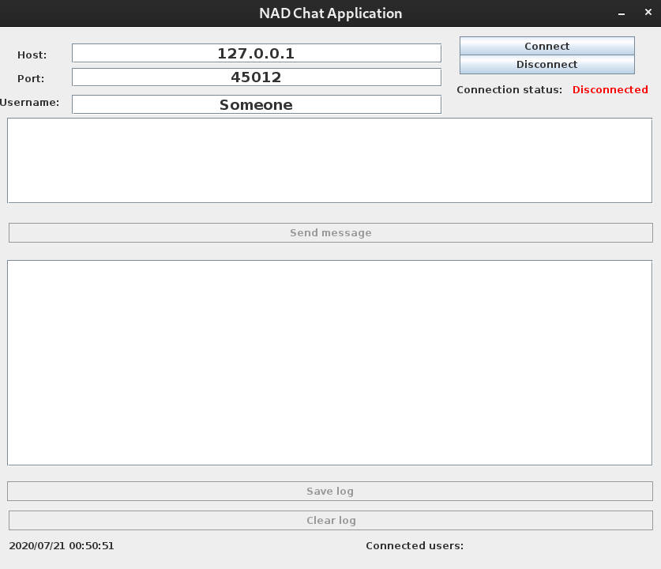
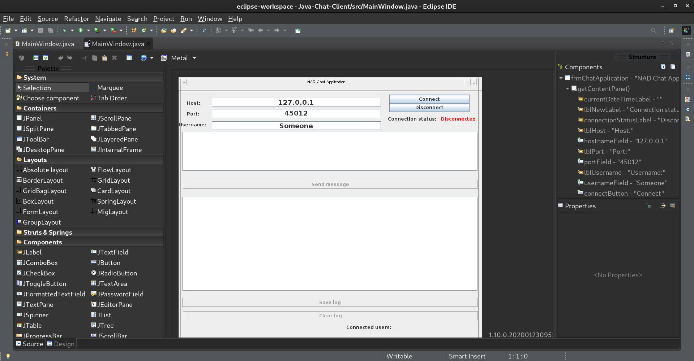

# Chat Application
A simple chat application implemented depending on *Client/Server* model.

The client is a GUI that is built using Java Swing and Sockets.

The server is built using Sockets only.

**Important:** to successfully run the application you must have Java 11 or above installed, notice that JRE is enough if all you want to do is to run the application, but if you want to make modifications then you must have JDK installed. This application was developed using **OpenJDK v11.0.7** 

## Server application
At first, you must run the server application.

Navigate to `Chat-Application/Java-Chat-Server/bin` then run the command:
```
java app.App [PORT_NUMBER [THREAD_POOL_SIZE]]
```

**Note:** The entry point for the application is the **App** class.

By default, the server use port **45012** and configures a thread pool of size **10**, but you can change those settings through optional command line parameters **[PORT_NUMBER]** and **[THREAD_POOL_SIZE]** respectively.

## Client application
After starting the server application successfully, you need to run the client application.

Navigate to `Chat-Application/Java-Chat-Client/bin` then run the command:
```
java MainWindow
```

The following window will popup:



After you click connect, this is how the window will look like:


Try creating another client and send some messages:


The server logs everything for you:


If the server falls down, you're notified about that (you can emulate this effect by closing the server shell while a client is connected):


## Importing into Eclipse
To import any of the projects into **Eclipse IDE** do the following:
1. Open **Eclipse IDE**
2. From the upper bar, click **Window** => **Show View** => **Package Explorer**, a new panel on the left will appear
3. Now on this panel, click **Import projects ...**
4. Choose **Existing Projects into Workspace** and click **Next**
5. Make sure the radio button with title **Select root directory** is checked, then click **Browse...**
6. Navigate to the directory where you cloned this repository, and choose the folder that contains **.project** file
7. Click **Finish**

**As for the client application: (if you want to edit the GUI)**

After you successfully import the client application into Eclipse, open it and look for **MainWindow.java**


- Right click on the file
- Hover at **Open With**
- Choose **WindowBuilder Editor** (you might need to install it from the marketplace if you don't have it)
- You will notice the appearance of a **Design** tab


- If you clicked it, the designer window will open, and from there you can move on

